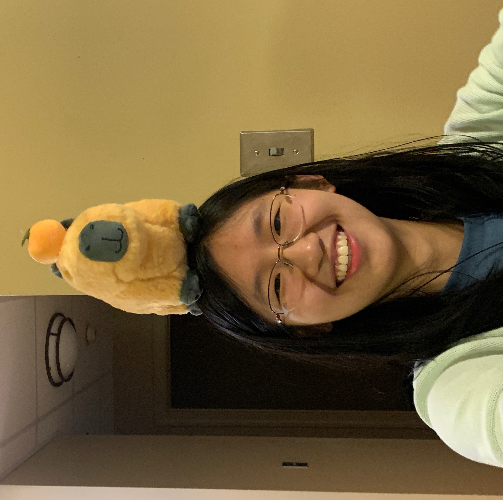

# Alanna Zhang

> Edited: 2/5/2025

{: .profile-photo}

## About

Hello! My name is Alanna Zhang. I'm a third-year Computer Science major with minors in Data Science and Statistics, and this is my first semester TA-ing for 423. I really enjoyed the collaborative aspect of this course, and my favorite part was working on the final project: an organization roster management system. For fun, I like to doodle and am currently attempting to get better at using colors in digital art.

## Projects & Links

-   [COMP 426 Personal Website](https://a01-personal-portfolio-alanna423.vercel.app/){:target="_blank"}
-   [GitHub](https://github.com/Alanna423){:target="_blank"}
-   [LinkedIn](https://www.linkedin.com/in/alanna-m-zhang/){:target="_blank"}

