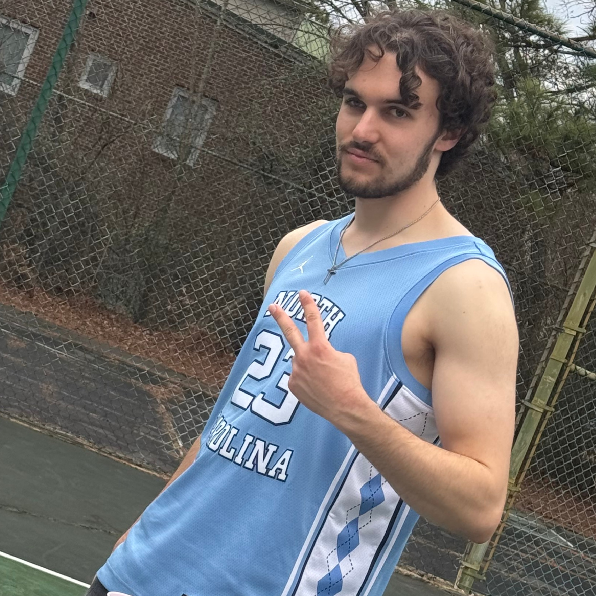

# Andrew Lockard

> Edited: 3/20/2025

{: .profile-photo}

## About Me

Hello there! Thanks for taking a peek at my bio! As you may already know, my name is Andrew Lockard. I am from Harrisburg, North Carolina and I am a senior pursuing a Computer Science BS and Applied Mathematics BS. This is my 3rd semester as a ULA with COMP 423. I have a focus on fullstack web development. After graduation, I will be working as a Software Engineering Associate Consultant with CapTech in Washington D.C!

Other than computer science, I enjoy working out, hiking/backpacking, going to concerts, hanging with friends, and watching UNC Basketball. In my spare time I also like to cook fun meals, play cards, and watch funny cartoons.

Feel free to connect with me and ask me any questions abour projects, software engineering, or anything else that might pique your interest. I'm looking forwaard to meeting you all!

## Where to Find Me

- [LinkedIn](https://www.linkedin.com/in/andrew-lockard/){:target="\_blank"}
- [Github](https://github.com/ItIsAndrewL){:target="\_blank"}

