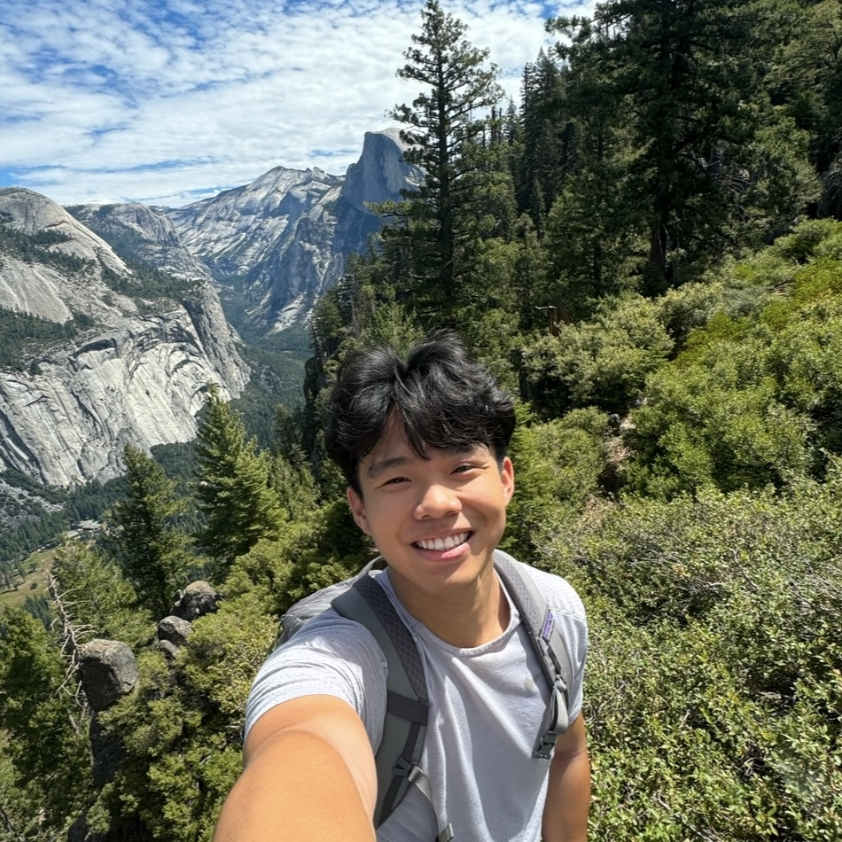

# Bernie Chen

{: .profile-photo}

## About Me

Hello! I'm a fourth-year double majoring in Computer Science (BS) and Business, with a minor in Math. I'm an international student from Toronto, Canada, and this is my first semester TAing for 423 - but my 6th semester as a TA for the CS department! I learned so much from taking 423 as a student, and it remains one of my favorite courses at UNC. I've continued to learn even more as a TA, and I'm so glad I had the chance to meet all the amazing people on this team! I definitely recommend becoming a TA if you're interested!

Outside of classes, I love traveling and trying new cuisines, hiking, and watching movies. I'm also a big F1 fan (go papaya)!

Feel free to connect with me, I'm always looking forward to meeting new people!

## Where to Find Me

- [LinkedIn](https://www.linkedin.com/in/berniechen/){:target="\_blank"}
- [Github](https://github.com/bcscc){:target="\_blank"}

