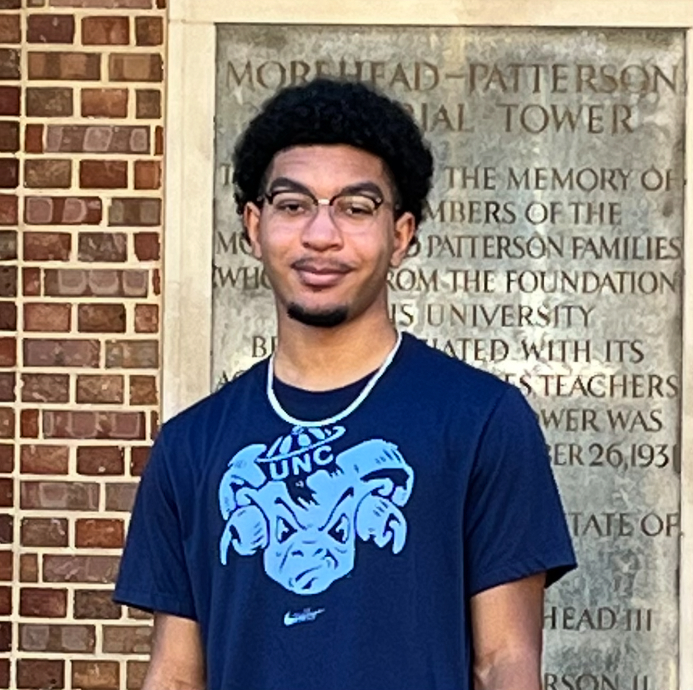

# Embrey Morton

{: .profile-photo}

## About Me

What's up everyone, my name is Embrey Morton. I'm a fourth-year Computer Science major as well as a Statistics & Analytics major. This is my first semester as a COMP423 TA, but I was a COMP301 TA for the previous three semesters. I truly enjoyed taking this course, as I met a bunch of cool people, and I learned valuable skills about full-stack development that gave a leg up with previous internships. So, I wanted to join the team to assist future students while further enhancing my knowledge as well. So, I am super grateful for the opportunity to work with you all!

Outside of the amazing computer science world, I am a huge sports fanatic. I grew up in Charlotte, NC so I am inevitably a fan of the Charlotte Hornets (sadly) and Carolina Panthers (a bit less sadly as of late thanks to Bryce Young). I'm also a pretty big gamer and I enjoy playing sports games, FPS games, and Marvel Rivals (currently a Grandmaster Loki main). I try to just be a chill guy to be honest.

## Where to Find Me

- [LinkedIn](https://www.linkedin.com/in/embrey-morton/){:target="\_blank"}
- [Github](https://github.com/embreymorton){:target="\_blank"}
- [Rivals-Tracker](https://tracker.gg/marvel-rivals/profile/ign/embreezy/overview?season=3){:target="\_blank"}

