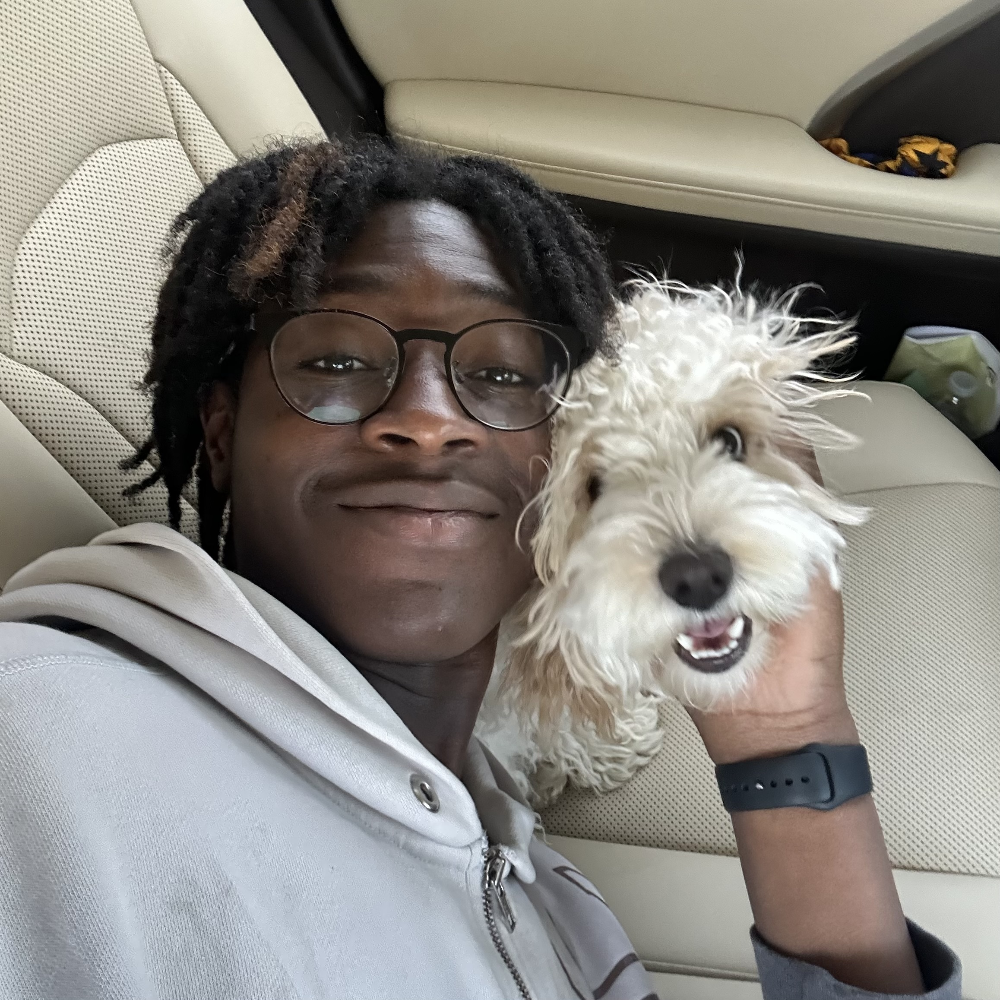

# Ife Babarinde

{: .profile-photo}

_Pictured: Me and Bolt_

## About

Hey! My name is Ife Babarinde and i'm a final-year Computer Science major. This is my first semester TA-ing for 423 and TA-ing in general.
I really enjoyed taking this course, so much so that I worked again under Kris for my COMP 523 class! I enjoyed that so much that I decided to return as a TA for this course. In this class, I had the opportunity to meet many other students and build a strong foundation for teamwork and full-stack development. Given that, I'm grateful to be back and look forward to helping in any way I can.

!!! info "CSXL"
    You also may have seen me in the CSXL, where I work as an Ambassador!

When I'm not in the XL or Office Hours, I enjoy reading books, watching movies, boxing and playing with my dog!

## Find Me Here

- :material-github: [Github](https://github.com/Ifebabs)  
  _Check out my stuff here!_

- :material-linkedin: [LinkedIn](https://linkedin.com/in/ifeoluwa123)  
  _Connect with me here!_

  - :material-filmstrip: [Letterboxd](https://letterboxd.com/simonslice/)  
  _Where I judge movies_

