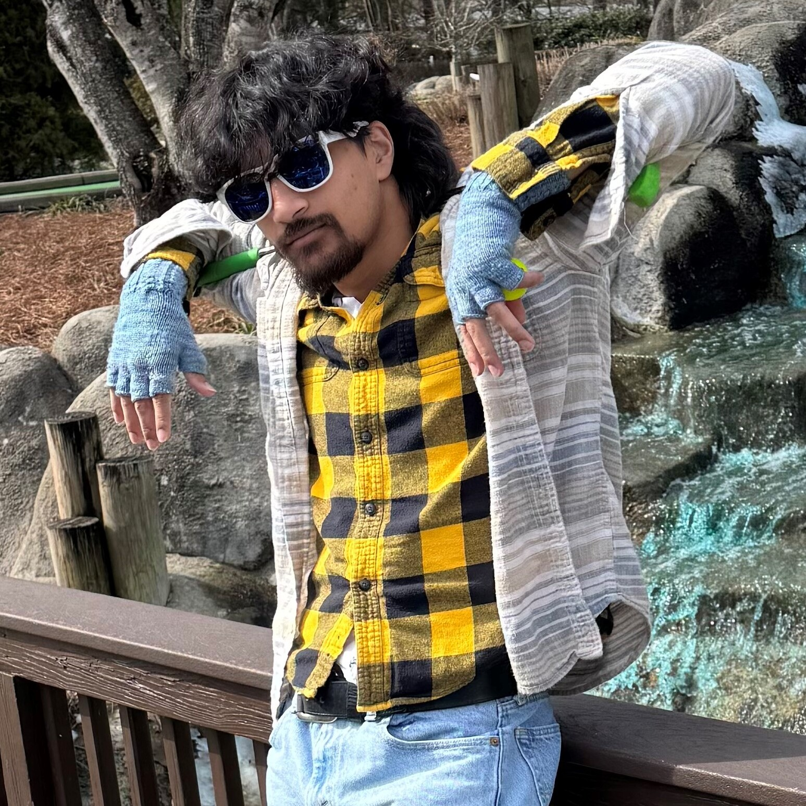

# Will Zahrt

> Edited: 3/5/2025

{: .profile-photo}

## About Me

Howdy! Thanks for checking out my bio! As you may already know, my name is William Zahrt but I go by Will. I am from Morgan Hill, California (Silicon Valley area) and I am a fourth year pursuing both a Computer Science BS and Data Science BS major here at UNC. This is my 5th semester as a ULA and my 3rd semester with COMP 423. I actually took the first version of this 590 with Kris and my final project was a FAQ page for the CSXL (which sadly did not get merged). I am proud to say that I have completed a digital signage feature in tandem with Andrew Lockard (another fellow ULA) this semester. So when you are checking into the CSXL and you see the beautiful TV screen full of useful info just know that I worked on that!

Other than computer science, I enjoy working out, biking, knitting, playing board games, and catching dubs in fortnite. I have a 15 year old blind and deaf dog named JoJo who I love with all my heart. I often travel back to the west coast to do backpacking trips with my Eagle Scout buddies from high school as well. 

I am glad I landed at Chapel Hill though. I'll be here for another year and a half pursuing the BS/MS Computer Science so I'll see y'all around for a couple of semesters to come!

## Where to Find Me

- [LinkedIn](https://www.linkedin.com/in/william-zahrt-2109a223a/){:target="\_blank"}
- [Github](https://github.com/wzahrt){:target="\_blank"}

