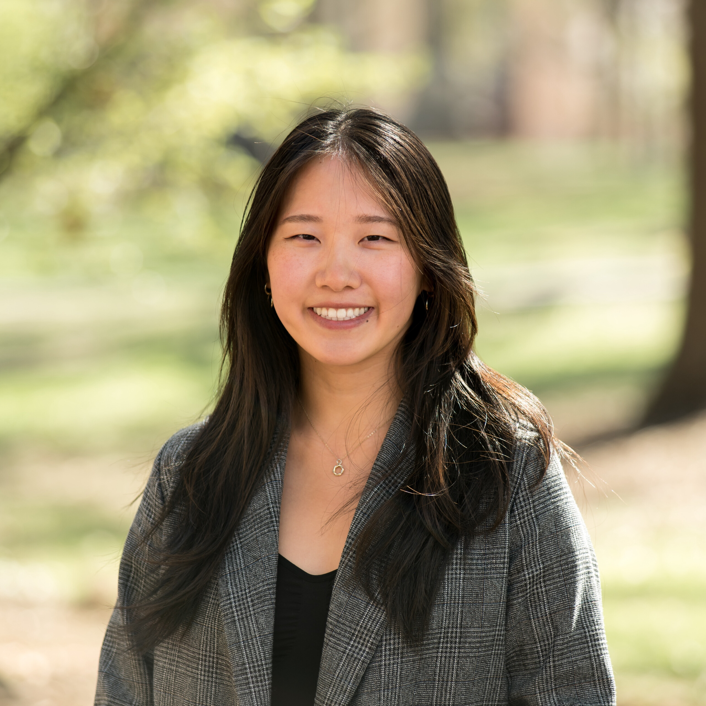

# Sunny Wang

> Edited: 3/4/2025

{: .profile-photo}

## About Me

Hi there! My name is Sunny Wang. I'm a fourth-year Computer Science major (B.S.) with a double major in Economics and a minor in Business Administration. This is my first semester TA-ing for 423, but actually my seventh (and last) semester TA-ing for the CS department. I'm really grateful for this course for teaching me so many valuable skills that I can apply in industry work. Being a TA is so awesome because I get to deepen my understanding on topics and work with such a wonderful team. One of my favorite parts is definitely hanging out during lectures and answering any questions you may have! In my free time, I like to cook, play racket/paddle sports, watch films, play Bananagrams, and travel. 

As an out-of-state student, I feel especially grateful to the CS community for bringing so many lovely people into my life. In addition to being a TA, I also serve as a Student Experience Ambassador for the department. Part of our role is to connect with the student body through coffee chats! So if you are interested in chatting with me and grabbing coffee (on us), feel free to schedule one [here](https://docs.google.com/forms/d/e/1FAIpQLSfqebzmpr6p3Wj7PrfrXNvpnMuhP4g6JfjvxZcNcWyi0NohWA/viewform){:target="\_blank"}! 

## Where to Find Me

- [LinkedIn](https://www.linkedin.com/in/sunny-x-wang/){:target="\_blank"}
- [Personal Website](https://www.sunnyxwang.com/){:target="\_blank"}
- [Letterboxd](https://letterboxd.com/sunnywang/){:target="\_blank"}

