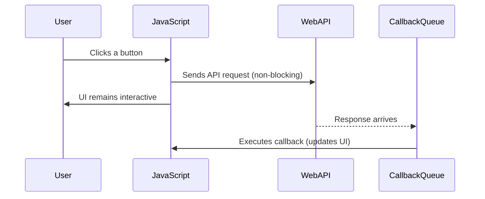
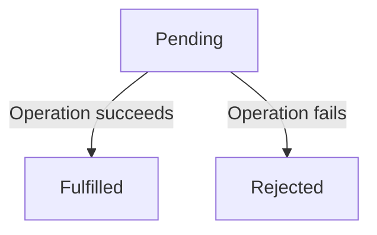

# Introduction to Event-Driven Programming in TypeScript

## Function Definitions and Arrow Functions

As a refresher from the previous reading, in TypeScript, functions are first-class citizens, meaning they can be assigned to variables, passed as arguments, and returned from other functions. One of the most common ways to define functions concisely is using **arrow functions**.

Here’s a simple example:

```typescript
const square = (x: number): number => {
    return x * x;
};
```

- The function takes a parameter `x` of type `number`.
- It returns a `number`.
- The function itself is stored in a variable `square`, which holds a reference to the function definition.

### Short-Hand Arrow Function Syntax

For functions whose bodies consist of a single return statement, like the `square` function, JavaScript and TypeScript provide a shorthand syntax:

```typescript
const square = (x: number): number => x * x;
```

This is still a **full function definition**! It simply omits the curly braces and `return` keyword to make the code more concise. This form is often used in functional programming and for inline callbacks.

## Functional Interfaces

In TypeScript, we can define an interface that represents a function type. This makes our code more structured and provides strong type-checking. Unlike an object-oriented interface, a functional interface does not name the methods it supports; it simply defines a function signature that any matching function can satisfy.

```typescript
interface UnaryFunction {
    (x: number): number;
}

const squareFunction: UnaryFunction = (x) => x * x;
```

### Why is this a Functional Interface?

The key distinction between a **functional interface** and a traditional **object-oriented interface** is that a functional interface does not define named methods; instead, it only specifies a function signature. This means that any function conforming to the parameter and return types can be assigned to a variable of this type.

### Understanding Function Types

A function’s type is determined by the combination of its **parameter types** and **return type**. This is intuitive because if two functions agree on these types, they can be used interchangeably in function call expressions without breaking type safety.

For example, consider:

```typescript
const double: UnaryFunction = (x) => x * 2;
const negate: UnaryFunction = (x) => -x;
```

Since `double` and `negate` both conform to the `UnaryFunction` signature, we can substitute one for the other in any context where a `UnaryFunction` is expected, and TypeScript will still type-check correctly.

This principle of substitutability ensures that TypeScript maintains strong type safety while allowing flexibility in function-based programming paradigms.

### Type Inference

A modern feature of TypeScript is **type inference**, which allows the compiler to automatically determine types based on context. Since the type of function variables like `double` and `negate` is explicitly defined, TypeScript can infer and enforce the correct parameter and return types without needing additional annotations.

This provides **the best of both worlds**: full type safety while reducing the effort required to redundantly specify types that can be inferred.

## Higher-Order Functions

A **higher-order function** is a function that takes another function as an argument or returns a function. This allows us to write more flexible and reusable code by parameterizing behavior.

### Higher-order Function Example: `map`

Before diving into the code, let’s break down `map` in English. Imagine you have a list of numbers, and you want to apply a specific operation—like squaring each number—to every element. One way to do this is with a loop, applying the operation to each item manually. But what if you want to apply different operations, such as doubling or taking the absolute value? Instead of writing separate loops for each case, we can use `map` to generalize the process.

The `map` function takes an array and a function as arguments. It applies the function to each element of the array and returns a new array with the transformed values. This lets us reuse `map` with any function we choose, making our code more modular and expressive.

### Implementing a Custom `map` Function

Here's an example of how we might implement `map` from scratch in TypeScript:

```typescript
const map = (arr: number[], func: (num: number) => number): number[] => {
    const result: number[] = [];
    for (const num of arr) {
        result.push(func(num));
    }
    return result;
};

const square = (x: number) => x * x;

const numbers = [1, 2, 3, 4];
const squaredNumbers = map(numbers, square);
console.log(squaredNumbers); // [1, 4, 9, 16]
```

### Why Pass Functions Around?

The ability to pass functions as arguments gives us powerful ways to structure our code. Instead of defining heavyweight classes or duplicating logic, we can simply pass different behaviors into a function like `map` to get the desired result. This keeps our code cleaner and more flexible.

For example, we can easily swap out the function to apply different transformations:

```typescript
const double = (x: number) => x * 2;
console.log(map(numbers, double)); // [2, 4, 6, 8]

const absolute = (x: number) => Math.abs(x);
console.log(map([-1, -2, 3, -4], absolute)); // [1, 2, 3, 4]
```

By using higher-order functions, we reduce redundancy and make our programs more expressive, letting us focus on the *what* rather than the *how*. This approach is at the core of functional programming and leads to more readable and maintainable code.

## Introduction to Event-Driven Asynchrony

Most modern web applications rely on event-driven programming to handle user interactions and network requests efficiently. Imagine clicking a button in a web app that triggers a network request to fetch data. If JavaScript were to process this request in a blocking manner, the entire page would become unresponsive until the request finished. This would be a terrible experience—no scrolling, no typing, no animations—just a frozen screen until the network responded. Instead, JavaScript uses an **event loop** and an **asynchronous model** to ensure that while waiting for a task to complete, the rest of the application can continue running smoothly.

### Why Asynchrony?

Web applications frequently make requests to APIs across the internet. These requests can take time to complete due to network latency, slow servers, or large amounts of data being transferred. If the UI were to block while waiting for each request, users would experience frustrating lags. Instead, JavaScript offloads such tasks to the **event loop**, which allows the browser to continue processing other user interactions while waiting for the network request to finish.

Here’s how the **event loop** works:



The event loop continuously checks the **callback queue** for pending tasks and runs them only when the main execution stack is empty. This ensures smooth execution without blocking.

## Promises and Fetch API

A **Promise** represents a value that might be available now, or in the future, or never. JavaScript provides a built-in `Promise` class, which is a powerful tool for handling asynchronous operations. Instead of writing nested callbacks (which can become unreadable), Promises provide methods that allow us to register behavior for when an operation completes or fails.

A `Promise` has two key methods:

* `.then(callback)` – Runs the callback function when the Promise resolves successfully.
* `.catch(callback)` – Runs the callback function when the Promise is rejected due to an error.

The `fetch` API in JavaScript returns a Promise when making HTTP requests. Here’s an example:

```typescript
const fetchData = (): Promise<void> => {
    return fetch("https://jsonplaceholder.typicode.com/todos/1")
        .then(response => response.json()) // First promise
        .then(data => console.log(data))   // Second promise
        .catch(error => console.error("Error fetching data:", error));
};

fetchData();
```

### Understanding Chained Methods and Fluent APIs

At first glance, this code might feel overwhelming, especially if you haven’t encountered **method chaining** or fluent APIs before. Let’s break it down step by step.

1. **Fetching Data**: The `fetch` function initiates an HTTP request to retrieve data from the given URL. It immediately returns a `Promise` that will resolve when the response arrives.
2. **Processing the Response**: Since `fetch` doesn’t directly return the data but a `Response` object, we need to call `.json()` on it. This method also returns a Promise, which resolves when the response body has been parsed.
3. **Handling the Data**: The next `.then()` receives the parsed JSON and logs it to the console.
4. **Error Handling**: If anything goes wrong (e.g., network failure or an invalid response), the `.catch()` method ensures we handle errors gracefully.

Each `.then()` method processes the result of the previous step, allowing us to **chain operations** in a clean and readable way. This avoids deeply nested callbacks (a problem known as "callback hell").

### Flow Explanation:

1. `fetch` returns a **Promise** resolving to a `Response` object.
2. We call `.json()` on the `Response`, which returns another **Promise**.
3. The second `.then()` handles the parsed JSON data.
4. If anything goes wrong, `.catch()` captures errors.

### Understanding the Promise State Machine

A **Promise** in JavaScript follows a specific lifecycle, transitioning through different states:



- **Pending**: The initial state, where the Promise is waiting for the asynchronous operation to complete.
- **Fulfilled**: The operation completed successfully, and the `then()` handler is called.
- **Rejected**: The operation encountered an error, and the `catch()` handler is called.

Each state transition happens exactly once. Once a Promise is either fulfilled or rejected, it cannot change state again.

By understanding how Promises work and integrating them into event-driven programming, we gain fine control over asynchronous workflows. This ensures that applications remain responsive and efficient, leading to a better user experience.


### Async/Await

The `async/await` syntax is a modern way to write asynchronous code in JavaScript that builds directly on top of Promises. It makes asynchronous operations easier to read and reason about by allowing developers to write code that looks synchronous while retaining all the benefits of non-blocking execution.

Under the hood, an `async` function always returns a Promise. The `await` keyword pauses execution inside the function until the awaited Promise resolves. This approach avoids deeply nested `.then()` chains and allows for more natural error handling with `try/catch` blocks.

Using `async/await`, we can rewrite the previous Promise-based example in a more readable way:

```typescript
const fetchDataAsync = async (): Promise<void> => {
    try {
        const response = await fetch("https://jsonplaceholder.typicode.com/todos/1");
        const data = await response.json();
        console.log(data);
    } catch (error) {
        console.error("Error fetching data:", error);
    }
};

fetchDataAsync();
```

### Why Use Async/Await?

- **Improves readability**: Makes asynchronous code look and behave more like synchronous code, reducing cognitive load.
- **Avoids callback hell**: Eliminates the need for deeply nested `.then()` chains, improving maintainability.
- **Intuitive error handling**: Uses `try/catch` instead of `.catch()`, making it more consistent with synchronous code.

### Understanding the Connection to Promises

The `async/await` syntax does not introduce a new asynchronous mechanism; rather, it is a **syntactic transformation** of Promise-based code. The JavaScript engine internally rewrites `async` functions into standard Promise chains.

For example, the above `async/await` function is equivalent to the following Promise-based implementation written before.

This transformation has been formally studied in **continuation-passing style (CPS) transformation** research, proving that `async/await` retains the same computational expressiveness as Promises while improving code clarity. The ability to represent asynchronous workflows more naturally makes `async/await` the preferred approach in modern JavaScript development.

